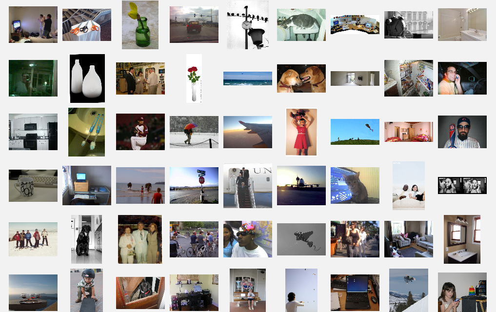
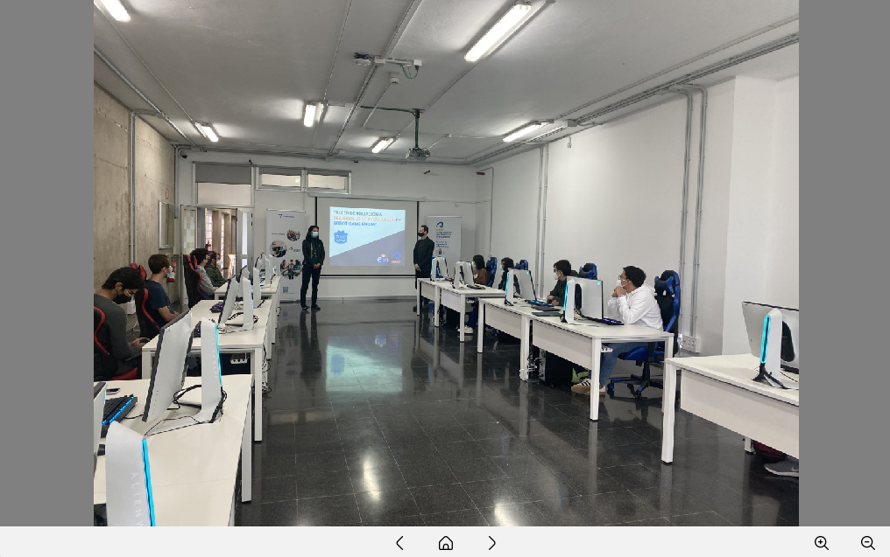

# Image Viewer 2026

Desktop image browser built with **Java Swing**, designed with the **Model-View-Presenter (MVP)** pattern.

## Key Features

The application operates both with buttons and gestures in two different scenarios:

1.  **Gallery Mode:** Browse through all the images loaded. Click on an image to open it on the viewer.

2.  **Image Viewer:** Watch images close-up. Zoom and pan on details if desired, navigate through to previous and next images.

---

## Architecture - Model View Presenter

The application makes use of the ***Model View Presenter*** pattern:

* **Model**: Domain representing classes: contains all classes needed to represent Images (like `Image` or `Canvas`). Immutable and with no references to the rest of the architecture.
* **View**: Also called *User Interface*, the view supplies the behavioral *contract* that the UI displays must follow (`ImageDisplay`, `GalleryDisplay`). It's only told to act to certain stimuli and catch user inputs, without making any decisions.
* **Presenter**: *View* mediator. It receives events (e.g., "Next Clicked"), decides its corresponding action based on business logic, and updates the View accordingly.

---

## Strategies and Techniques

The project follows Clean Code and SOLID principles. Some of the strategies and techniques utilized to comply with these fundaments are:

* **Single Responsibility Principle (SRP)**: Every class has one and only responsibility. This makes a significant impact on abstraction and code legibility.
* **Command Pattern**: Behavioral Design Pattern that decouples the invoking and the actual execution of an action.
* **Adapter Pattern**: Implemented via the `MouseAdapter` class in both Swing implementations of the displays. It acts as a converter from the AWT Listeners to the application classes and vice versa. This makes decoupling and translating data between the two entities easy.
* **Lazy Loading**: High-resolution images are loaded from the disk only when strictly required for display, rather than preloading the entire directory into memory. This optimizes memory usage and startup time.
* **Memoize**: Once loaded for the first time, images are cached following the *Memoize* pattern, making interaction quicker and more fluid.
* **Dependency Inversion Principle (DIP)**: Both the Commands and the Presenters use this principle. These classes are linked to abstractions (and not actual application implementations). The UI and IO elements are injected as dependencies to the commands, avoiding circular dependencies.

---

## How to Run

1. Load the desired images into the **/images** directory:
2. Run `Main`.

---

## Technical Stack

* **Language**: Java 17+
* **UI Framework**: Swing (Standard Library)
* **Look-And-Feel**: [`FlatLaf`](https://mvnrepository.com/artifact/com.formdev/flatlaf)
* **Testing**: [`JUnit`](https://mvnrepository.com/artifact/junit/junit) and [`AssertJ Core`](https://mvnrepository.com/artifact/org.assertj/assertj-core)

---

## Acknowledgements

   Uicons by <a href="https://www.flaticon.com/uicons">Flaticon</a>.

